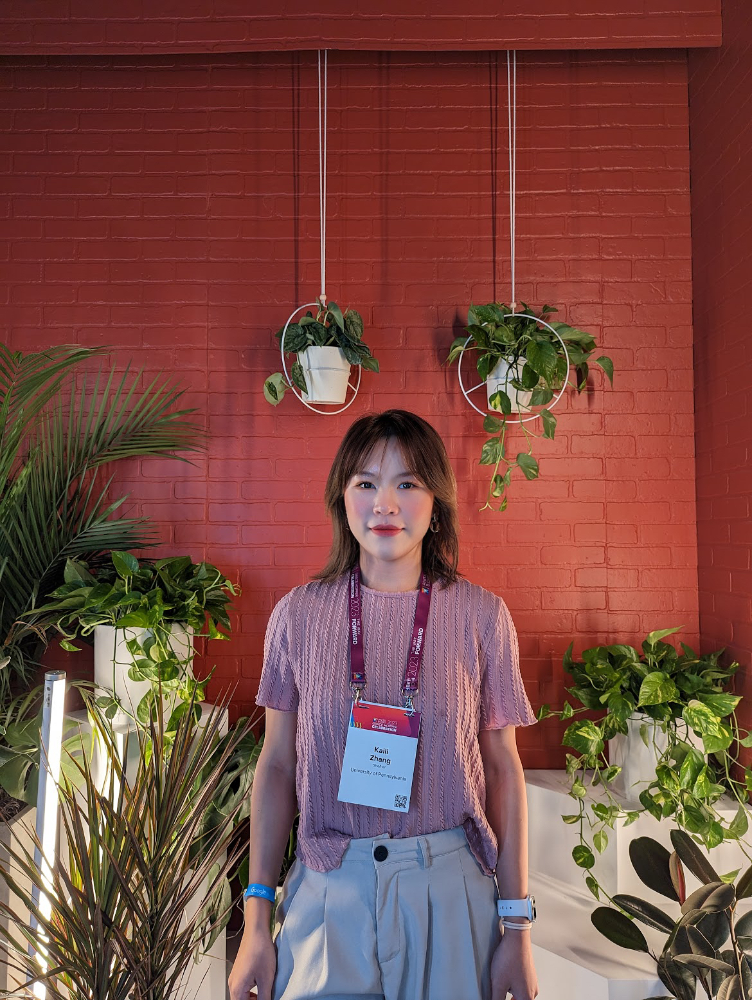

# Early Years
Growing up, I was never a confident person. I was often described as an introverted and shy child. I had an average appearance 
and average grades in school. The only subject I excelled in was English, which eventually led me to enroll in an international 
class with the goal of applying to colleges abroad.

Somehow, I ended up attending one of the best high schools in my hometown, and later, I was accepted into Rice University, 
which has a high national ranking. It was during this time that I began to experience imposter syndrome. I doubted myself 
and wondered why I had been admitted to such prestigious schools. My parents' friends often praised me as a role model for 
their children, citing my good grades and behavior. But deep down, I saw myself as an average person and felt I was far 
from being a role model to anyone.

  
    
When I was 18

As I grew older, I became more aware of my appearance. I started experimenting with makeup and putting together better 
outfits. I began receiving compliments about how much better I looked, which brought me a sense of satisfaction. However, 
I still lacked confidence. I constantly compared myself to other girls on the street, believing they had better body 
shapes or more stylish outfits.

# Turning Point

The turning point came when I started graduate school. I made the difficult decision to quit my job as a business analyst 
and switch my major to computer science. This was a daunting choice, especially considering that I had never been particularly 
good at school, particularly in subjects like math or physics. I had never imagined learning computer science, let alone 
becoming a software engineer. Fortunately, I received an offer from the MCIT program at UPenn.

The first semester, however, was the toughest time of my life. I went through some traumatic and life-changing events, 
and I often cried myself to sleep, questioning why I had chosen this major and this school. The tragedy I experienced was 
not my fault, but looking back, I realize I was in a period of feeling empty and lacking confidence, constantly seeking 
approval from others. I wasn't focused on what I had come to do and got distracted by other things.

# Building Resilience

As the new semester began, I was determined to study hard and secure a summer internship. What helped me push through the 
tough moments was going to the gym and studying. These activities allowed me to block out negative thoughts and mindsets.
During this time, I also explored newer hobbies that helped me regain a sense of control and build my 
confidence. I took up golf and tennis, which not only provided a outlet but also allowed me to develop new skills and meet new people.
More importantly, I had faith in myself that I could survive this challenge and prove that I could live a much better life than those 
who had hurt me. Eventually, I landed a summer internship, which I believe played a significant role in helping me find 
a full-time job later on.

When the second year started, I knew the job market was tough, but I had unwavering faith in myself. Every day, I told 
myself that I could find a job. I attended career fairs, conferences, applied for jobs daily, and practiced coding 
consistently. In addition, I continued to exercise regularly, eat healthily, and stay connected with my close friends. 
Those several months were fast-paced, but I felt fulfilled because I had a clear goal and believed in my ability to achieve it.

In the end, I received two full-time job offers, one from InterSystems and another from Amazon. I never would have imagined 
achieving this when I first decided to apply for a computer science program three years ago.

  
    
Me at the Grace Hopper Celebration 2023

# Embracing Confidence

During the summer, I returned to China and reunited with many family friends. This time, when I heard their praises, I 
genuinely felt worthy of them. It's not just because I received job offers, but because I know how hard this journey was, 
and I am so proud of myself.

I've now been in Boston for three weeks and started my role as a SDE at InterSystems. It's the fourth city I've lived in 
since coming to the United States. As I settle into this new chapter of my life, I feel a sense of excitement and 
anticipation for what lies ahead. The journey to get here has been challenging, but it has also been incredibly rewarding. 
For the first time, I genuinely feel confident in my abilities and proud of the person I've become. I'm ready to embrace 
the opportunities that Boston has to offer and continue growing both personally and professionally. This is just the beginning, 
and I can't wait to see where the future takes me.