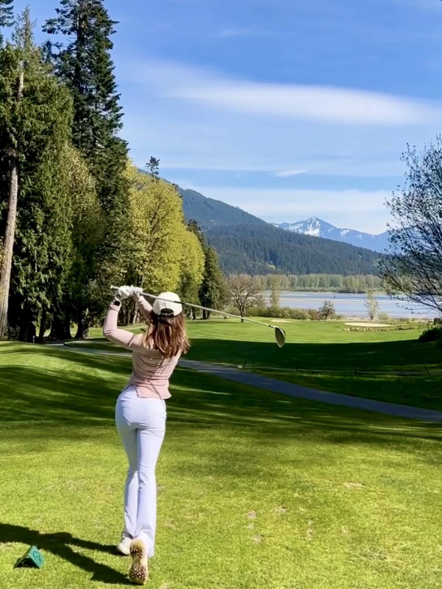
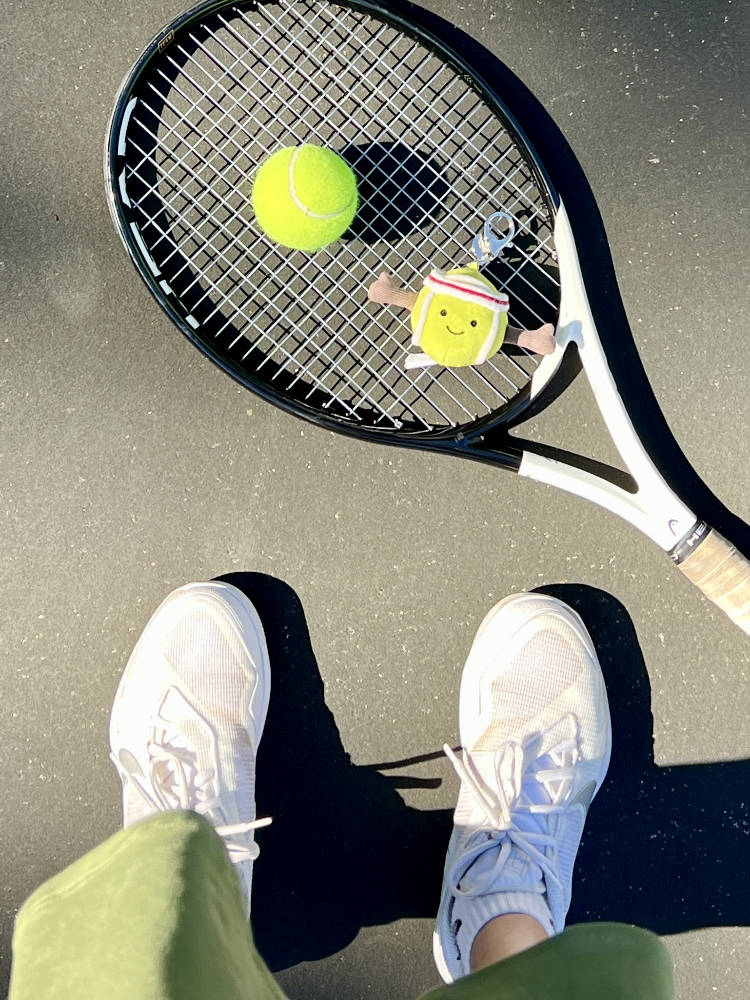

  

# The Highs and Lows of Playing Golf

Having started playing golf two years ago, I still haven't recorded my score on the course because I believe it would be more than 100.

Golf is hard—extremely hard. Even pros have bad shots or swings occasionally. However, it's still difficult to maintain a calm and positive mindset when I don't perform well, whether on the driving range or out on the course.

Some days are excellent for me: great driver shots, nice short games, maybe a few pars. More often, though, I experience topping, slicing, or dropping balls into the water. Despite this, I frequently hear from my group members—most of whom are much older than I am—that I have a great setup and swing. They say I'm just not consistent enough yet and that I'll perform really well if I keep playing.

# The Joy of the Game

One may ask, what is the allure of golf? Why does everyone seem to become addicted once they start playing? The golf club faces are quite small, and to have a good shot, you need to have a good backswing, downswing, direction, and great contact.

The moment I hit a perfect shot, the sound and feeling of it are mesmerizing. I just want to continue hitting another good shot.

Now, however, what I love about golf is also because it's a mind game—a private conversation with myself. Before hitting the ball, I remind myself of the key points I need to notice. If I make a bad shot, I stop and reflect on what went wrong and try to adjust accordingly. Is it my swing, my contact, or something else? I could make 100 practice shots in a row, but it won't help me improve if I don't stop and reflect on my performance.

  

# Discovering Tennis
Tennis is a relatively new hobby for me. I started last year, took a few lessons, and hurt my wrist last summer. But I restarted and have been playing regularly for the past month. I've also received compliments that, as a new player, I have good swings and strength. Still, I haven't been playing well in the past few days, and I kind of lost it today. It's really frustrating when I can't hit a good backhand even though I know what I'm doing wrong.

# Consistency is Key
As I've discovered through both golf and tennis, consistency is a crucial element in achieving success. In both sports, it's not just about having one great shot or game—it's about being able to replicate good performance over time. This has been one of the most challenging aspects for me, but also one of the most rewarding.

In golf, consistency means refining my swing and having a good contact so that I can reliably hit the ball well, no matter the conditions or my state of mind. It involves building muscle memory and developing a routine that I can depend on. Every time I step up to the tee, I try to follow the same process, focusing on the same key points. This helps me stay calm and focused, even when I'm under pressure.

In tennis, consistency is equally important. It means being able to return serve after serve with the same level of accuracy and power. It's about developing a rhythm and sticking to it, even when I'm tired or frustrated. I've found that the best way to improve my consistency is through regular practice. The more I play, the more natural my movements become, and the less I have to think about them.

However, maintaining consistency is not easy. It requires patience, perseverance, and a willingness to keep practicing, even when progress seems slow. There are days when I feel like I'm not improving at all, and it can be incredibly frustrating. But I remind myself that every practice session, every game, is a step towards becoming more consistent.

# Lessons Learned
I know that I'm not trying to compete or become a professional player; I play for fun and health. However, I get frustrated because I want to see progress in myself. Growing up, I wasn't particularly good at or excelled in anything specific. So being athletic is something I'm slightly proud of, and it's disappointing when I don't perform as well as I want. But now that I think about it, it's only been less than two years since I started playing these sports. What is my goal? My goal is to continue doing these activities for the next five years, ten years, even fifty years. My goal is to play golf with my father on courses all over the world, to play tennis with my friends after work and on weekends, just to enjoy the exercise and camaraderie.

**So, I didn't play well today. That's fine. I'll just continue to hit another ball tomorrow.**