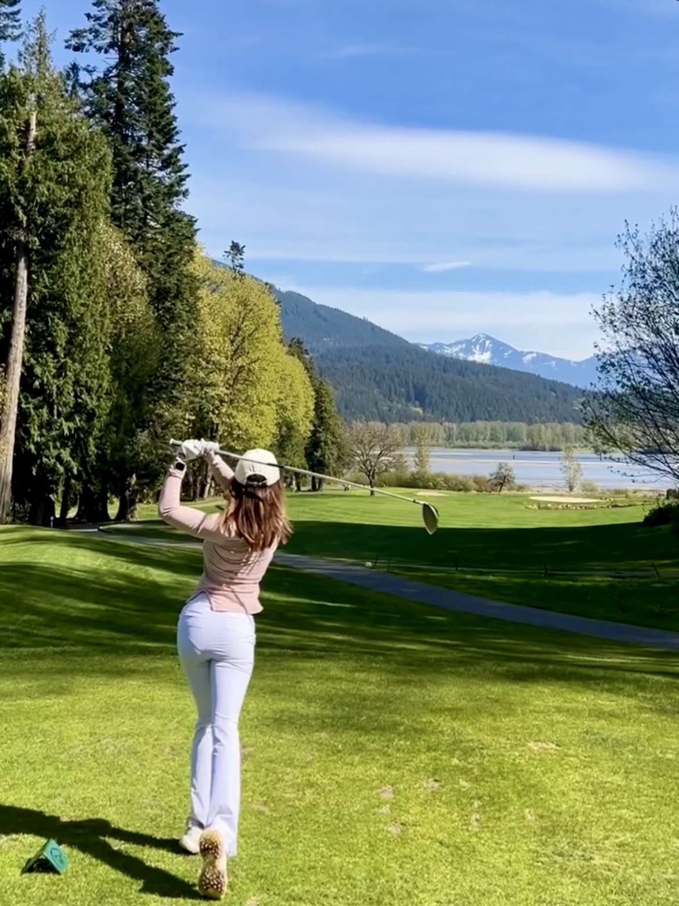
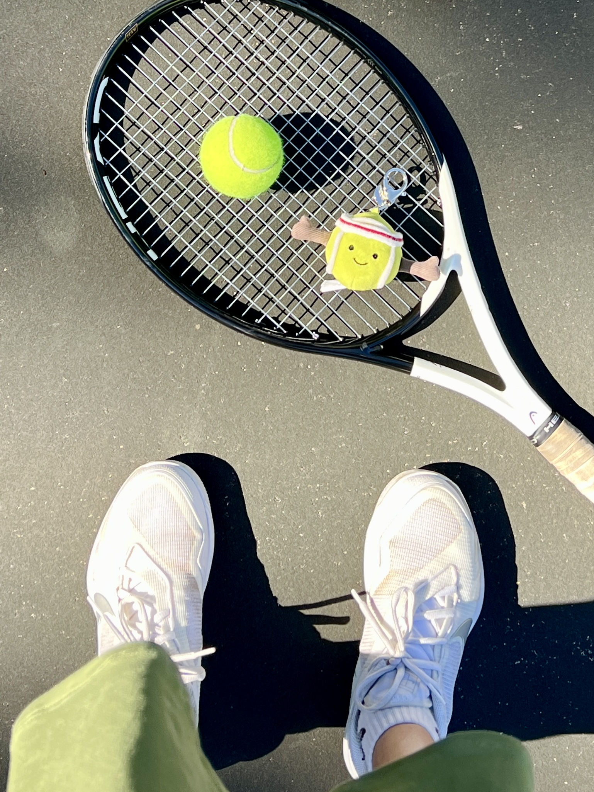

# The Highs and Lows of Playing Golf

Having started playing golf two years ago, I still haven't recorded my score on the course yet, because I believe it would be more than 100.

Golf is hard—extremely hard. Even pros have bad shots or swings occasionally. However, it's still difficult to keep a calm and positive mindset when I don't perform well either on the driving range or out on the course.

Some days are excellent for me: great driver shots, nice short games, maybe a few pars. More often, though, I experience topping, slicing, or dropping balls into the water. Despite this, I frequently hear from my group members—most of whom are much older than me—that I have a great setup and swing. They say I'm just not consistent enough yet and that I'll perform really well if I keep playing.

# Discovering Tennis
Consistency is key. That's what I've heard from my peer who plays tennis. Tennis is a relatively new hobby for me. I started last year, took a few lessons, and hurt my wrist last summer. But I restarted and have been playing regularly for the past month. I've also received compliments that, as a new player, I have good swings and strength. Still, I haven't been playing well in the past few days, and I kind of lost it today. It's really frustrating when I can't hit a good backhand even though I know what I'm doing wrong.

I know that I'm not trying to compete or become a professional player; I just play for fun and health. However, I get frustrated because I want to see progress in myself. Growing up, I wasn't particularly good at or excelled in anything specific. So being athletic is something I'm slightly proud of, and it's disappointing when I don't perform as well as I want. But now that I think about it, it's only been less than two years since I started playing these sports. What is my goal? My goal is to continue doing these activities for the next five years, ten years, even fifty years. My goal is to play golf with my father on courses all over the world, to play tennis with my friends after work and on weekends, just to enjoy the exercise and camaraderie.

**So, I didn't play well today. That's fine. I'll just continue to hit another ball tomorrow.**